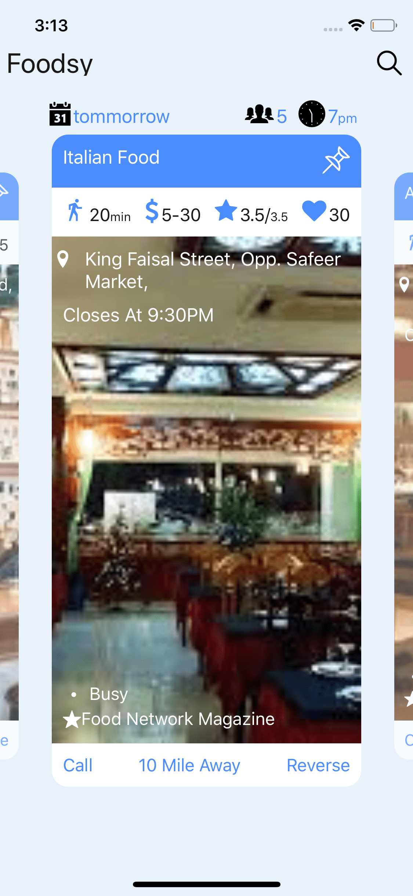
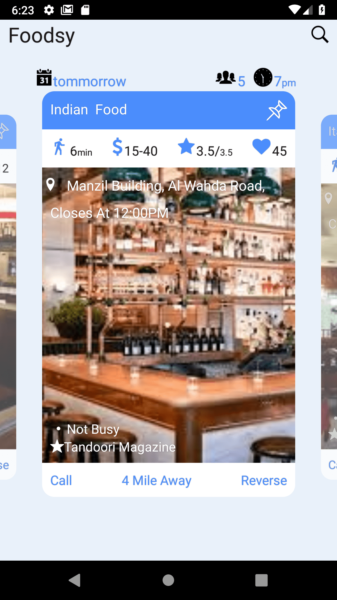
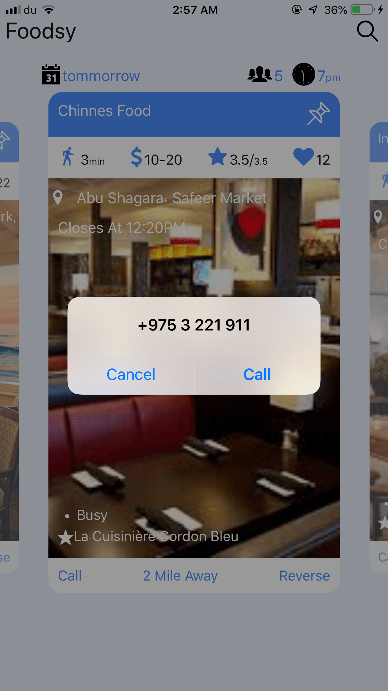

#  Foodsy
[](http://standardjs.com/)

* Food Order App 

## <<----screen shot and gif --->>




## :arrow_up: How to Setup

**Step 1:** git clone this repo:

**Step 2:** cd to the cloned repo:

**Step 3:** Install the Application with `yarn` or `npm i`

## Features
##  Part II: Minimum Requirements (Done )
 * The restaurant name
 * Picture from the restaurant
 * Phone number to call on click 
   > But it only work on Real Device  Check screen shot on real deveice


              
* Brief intro of the restaurant type
## Part III: Additional Requirements (Done)
 * I use Redux State Management for manging state of the application
 * Redux Saga for MiddleWare and async function like call backend 
 * I use mocked Custome Api also my  Application supports http call i use api sauce a
 * for Mock api support i use Json and store folder called Fixtures and write service that simulate to call and get json
 * saga will call same like it call api to the mock and get data and store to redux
 * redux I use redux persist to store data in memory asyncStorege
 * To change from Mock  to real api all you need to do is just change /config/DebugConfig.js useFixture to false
 ```export default {
  useFixtures: true,
  ezLogin: false,
  yellowBox: __DEV__,
  reduxLogging: __DEV__,
  includeExamples: __DEV__,
  useReactotron: __DEV__ }  
  ``` 
 * and then cofigure your custom url and call in /Services/Api.js

 * I use React Native Navigation v2 wix for navigation  support 
 * ALL my Code is easy to understand components is for reusable code containers is for screen i add readme.me each folder
 * all image are in Images
 * all theme  image require and colors is in /Themes/
 * all redux is in /Redux/
 * all saga /Saga/

## Part III: Additional Tests (Done)
 * All my code is linted standar
 * I write test for all function in redux
 * wrote test for all funciton in saga
 * all test passed
 * test i use enzym 
 


## :arrow_forward: How to Run App

1. cd to the repo
2. Run Build for either OS
  * for iOS
    * run `react-native run-ios`
  * for Android
    * Run Genymotion
    * run `react-native run-android`


**To Lint on Commit**

This is implemented using [husky](https://github.com/typicode/husky). There is no additional setup needed.

**Bypass Lint**

If you have to bypass lint for a special commit that you will come back and clean (pushing something to a branch etc.) then you can bypass git hooks with adding `--no-verify` to your commit command.

**Understanding Linting Errors**

The linting rules are from JS Standard and React-Standard.  [Regular JS errors can be found with descriptions here](http://eslint.org/docs/rules/), while [React errors and descriptions can be found here](https://github.com/yannickcr/eslint-plugin-react).

## :closed_lock_with_key: Secrets

This project uses [react-native-config](https://github.com/luggit/react-native-config) to expose config variables to your javascript code in React Native. You can store API keys
and other sensitive information in a `.env` file:

```
API_URL=https://myapi.com
GOOGLE_MAPS_API_KEY=abcdefgh
```

and access them from React Native like so:

```
import Secrets from 'react-native-config'

Secrets.API_URL  // 'https://myapi.com'
Secrets.GOOGLE_MAPS_API_KEY  // 'abcdefgh'
```

The `.env` file is ignored by git keeping those secrets out of your repo.

### Get started:
1. Copy .env.example to .env
2. Add your config variables
3. Follow instructions at [https://github.com/luggit/react-native-config#setup](https://github.com/luggit/react-native-config#setup)
4. Done!
